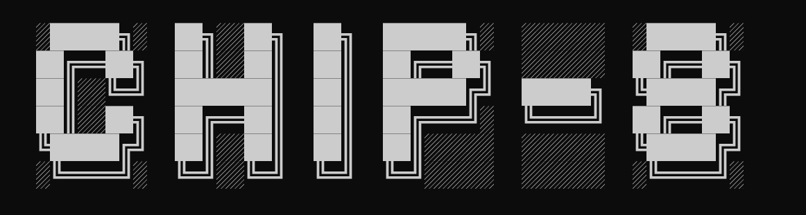
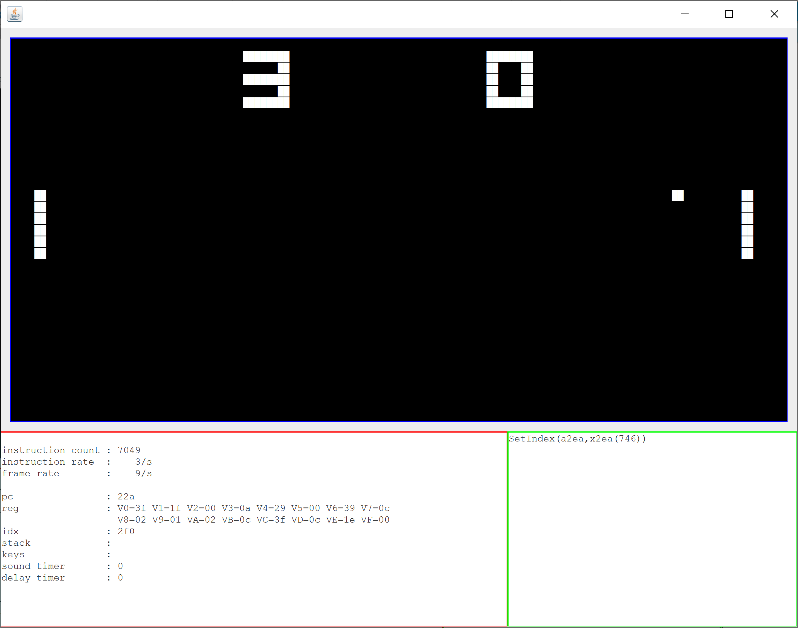

# CHIP-8 Emulator

A CHIP-8 Emulator written in Scala as part of my [SPAM-1 project](https://hackaday.io/project/166922-spam-1-8-bit-cpu). 

This emulator will help me understand CHIP-8 and decide whether I can also write a cross compiler from CHIP-8 to SPAM-1 so I can bootstrap SPAM-1 with some existing software.

Current status is that this emulator works including a beep sound that can be heard when playing pong.

## Things I Learned

Seems many CHIP-8 games don't have source code.

If I only have ROMs then to cross compile to SPAM-1 I first need to identify the instructions; ie disassemble the CHIP-8 game ROM.
 
However, not all games have all their instructions aligned to an even address in memory meaning I can't simply take pairs of bytes in order and consider each an instruction.
Instead a disassembler may need to walk the code tree recursively if one wants high accuracy. I have seen at least one 3rd party attempt at this - I don't know whether it's reliable.

Even if one did use a disassembler then the BXXX instruction allows jumps to anywhere in memory so without actualy executing the program and tracing all execution paths then BXXX is a problem.

However, I've not come across a single usage of BXXX yet.

Also most games do seem to follow the practice of alignment to even memory addresses.

Better still there does seem to be some source code avaiable for some games.

So I now need to go back to working out how to convert a short game with few instruction types to SPAM-1, having it use the UART terminal for its 'screen'.

## Credit 

https://fsymbols.com/generators/carty/
